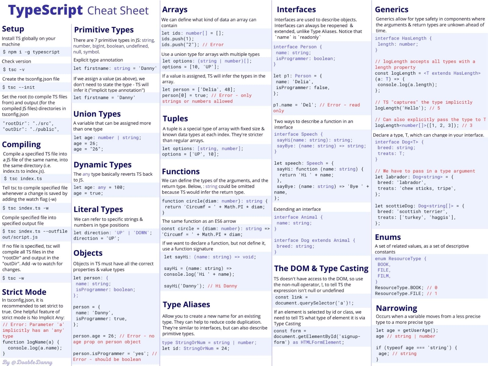

# [Typehero.dev](https://typehero.dev)

## [Typescript Cheat Sheets](https://github.com/xam1dullo/typehero/blob/main/Typescript%20Cheat%20Sheets/)

### Type Challenges

> Engage in TypeScript challenges to strengthen your grasp of the type system and advanced features

---

# TypeScript Foundations

> TypeScript Foundations is a curated set of challenges designed to build a strong foundation. From basic syntax to advanced concepts, this collection offers hands-on exercises to help you become a TypeScript Hero

## Beginer

- [Primitive Data Types](https://github.com/xam1dullo/typehero/blob/main/challenges/primitive-data-types/prompt.md)
